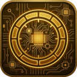

<!-- SPDX-License-Identifier: GPL-3.0-or-later -->

# BC250 Bazzite Suite

Tools for the AMD BC-250 running Bazzite, in one repository. The **[portal](portal)** installs, opens, updates
and removes them: BC-250 Bazzite Test is always installed, every other app is optional.

-  **[BC-250 Bazzite Test](apps/bazzite-test)**: Read-only diagnostics, stress test and benchmarks. Always installed.
-  **[BC-250 GPU Governor Manager](apps/governor)**: Manage the cyan-skillfish GPU governor: tuning, safe points, profiles, backups.
-  **[BC-250 HelixSR Manager](apps/helixsr)**: Deploy HelixSR (FSR 3.1 drop-in upscaler with DLSS-style networks) into games.
-  **[BC-250 CU Bisect](apps/cu-bisect)**: Tell bad CUs apart from an unstable CU unlock, and apply a tested unlock.
-  **[BC-250 Cores Bisect](apps/cores-bisect)**: Tell bad CPU cores apart from an unstable core unlock, before you persist the 8C/16T unlock.
-  **[BC-250 GPU OC Bisect](apps/gpu-oc-bisect)**: Find your board's safe GPU overclock and undervolt, one step at a time.
-  **[BC-250 Persistent ACPI](apps/persistent-acpi)**: CPU C-states and frequency scaling through a persistent ACPI override (GRUB early initrd).
-  **[BC-250 System Overlay](apps/system-overlay)**: CPU, GPU, refresh rate, fan and temperatures in a small window that stays on top.
-  **[BC-250 BIOS Reader](apps/bios-reader)**: The BIOS settings as the setup screen shows them, hidden menus included. Stock or modded BIOS. Read-only.
-  **[BC-250 ACE Queues](apps/ace-queues)**: Async compute for games: a patched RADV beside the system Mesa, built on the board and tested before use.

How to install and use them: **[the manual](https://robertotorino.github.io/bc250-bazzite-suite/)**.

## License

GPL-3.0-or-later ([LICENSE](LICENSE)), except BC-250 Persistent ACPI, which is MIT. Each app keeps its own
`LICENSE`.
