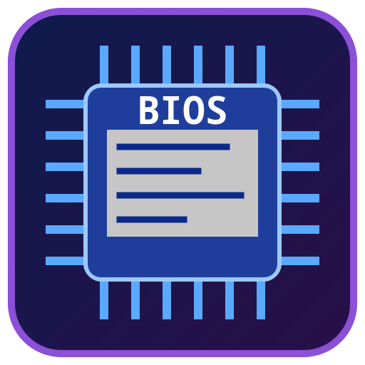

# bc250-bios-reader



Reads the BIOS settings of the **AMD BC-250** on **Bazzite** and shows them in a layout like the BIOS setup
screen, hidden menus included. It only reads: nothing on the board or in the BIOS changes.

It also tells a stock BIOS from a modded one and says what gave it away.

## Using it

The window opens on **this board**: the setup screens of its BIOS release and the values Linux can read.

- **Tabs:** Main, Advanced, Security, Boot, Save & Exit, then the pages other BIOS modules add (AMD CBS, network,
  recovery). Left and Right switch tabs.
- **Items:** Up and Down select, Enter opens a submenu, Esc goes back. The right side shows the item's help, its
  value and default, its options and where it is stored (for example `AmdSetup + 0x25F, 4 bytes`).
- **Show hidden items** (or H): also lists what the BIOS does not show, in grey italics, with the reason: hidden
  always, hidden by the value of another setting, or a menu no link leads to. The extra **Not linked** tab opens
  the menus that no menu links to.
- **The badge** next to the title: Stock BIOS or Modded BIOS. Hover it to see why.
- **Read BIOS chip…:** reads the flash chip and opens the dump. See below.
- **Open dump…:** opens a BIOS image made earlier. **This board** goes back to the running board.

### What this board shows without a dump

Linux can read only the UEFI variables the BIOS leaves visible after boot. On the BC-250 that is `AmdSetup`, the
AMD CBS settings, so those show their real values. The main `Setup` variable (the Main, Advanced, Chipset and Boot
options) is hidden after boot: those options show `[?]`, and their help shows the default. A dump of the flash chip
has both.

The setup screens themselves come from a table built into the app, one per known BIOS release (P5.00). For another
release, read the chip: the app then reads the screens from the dump.

## Where the settings come from

The BC-250 runs an AMI Aptio BIOS. Its settings are stored as UEFI variables in the NVRAM part of the BIOS flash
chip.

| Variable | What it holds | Readable from Linux |
|---|---|---|
| `AmdSetup` | the AMD CBS options (CPU, memory, GPU) | yes, `/sys/firmware/efi/efivars`, no root needed |
| `Setup` | the main Aptio options (Advanced, Chipset, Boot) | no, the BIOS hides it after boot; only in a flash dump |
| `StdDefaults` | the default values | only in a flash dump |
| `AMITSESetup` | settings of the setup screen itself | only in a flash dump |

A variable is just bytes. The names, allowed values and menus of the options are stored as forms (HII/IFR) inside
the BIOS image. These forms map each byte in `Setup` or `AmdSetup` to an option such as "UMA Frame Buffer Size".
They also hold the conditions under which the setup screen hides an option or a menu, which is how the app knows
what is hidden.

## Reading the BIOS flash chip (optional)

You decide whether to make a full dump of the flash chip. The app works without one. Reading is safe: flashrom only
reads with `-r`, and the app never runs it otherwise. Never run flashrom with `-w` or `-E` yourself.

The BC-250's BIOS sits on a **Winbond W25Q128.V** (16 MiB, SPI) behind the AMD FCH.

### Getting flashrom

Homebrew's flashrom has no `internal` programmer, so it cannot read the board's own chip. Fedora's package can.
Unpack it into a folder of your own instead of layering it onto Bazzite:

```bash
mkdir -p ~/flashrom && cd ~/flashrom
dnf download flashrom.x86_64 libjaylink.x86_64
rpm -K ./*.rpm                      # signatures must be OK
for p in ./*.rpm; do rpm2cpio "$p" | cpio -idm; done
```

The app finds flashrom in `~/flashrom` (and on the PATH).

### From the app

**Read BIOS chip…** asks first, then runs flashrom twice through a password prompt and compares the two reads. The
dump goes to `~/.local/share/bc250-bios-reader/dumps/` and opens right away. Uninstalling the app keeps the dumps;
`--purge` removes them.

### By hand

Probe first. This only detects the chipset and the chip:

```bash
sudo env LD_LIBRARY_PATH="$HOME/flashrom/usr/lib64" ~/flashrom/usr/bin/flashrom -p internal
```

Look for `Found Winbond flash chip "W25Q128.V" (16384 kB, SPI)`. Then read the chip, twice:

```bash
sudo env LD_LIBRARY_PATH="$HOME/flashrom/usr/lib64" ~/flashrom/usr/bin/flashrom -p internal -c "W25Q128.V" -r bios.bin
sudo env LD_LIBRARY_PATH="$HOME/flashrom/usr/lib64" ~/flashrom/usr/bin/flashrom -p internal -c "W25Q128.V" -r bios2.bin
sha256sum bios.bin bios2.bin        # both must match
```

Two identical dumps mean the read is stable. Each ends with `Reading flash... done.` Open `bios.bin` with
**Open dump…**.

What flashrom prints on the BC-250, and why it does no harm:

- **`No DMI table found` and the laptop warning:** flashrom cannot tell what kind of machine this is and turns
  off some buses to be careful. The BC-250 has no embedded controller (EC), which is what the warning is about,
  and the SPI bus it needs is still found. No `laptop=` override is needed.
- **`Enabling flash write... OK`:** flashrom prepares the chipset as it always does. Nothing is written without
  `-w`.
- **`/dev/mem mmap failed` lines** (probe without `-c` only): flashrom tries chip types larger than 16 MiB at
  addresses that are not flash on this board, and the kernel refuses them. Naming the chip with `-c` skips them.

A dump is your board's own firmware, with its settings. Keep it to yourself.

## Unpacking a dump

The app unpacks a dump itself. To look inside one by hand: a dump is a 16 MiB image, most of it (about 80 %) empty
(`0xFF`). [UEFITool](https://github.com/LongSoft/UEFITool) opens it; its command-line tool UEFIExtract unpacks it:

```bash
uefiextract bios.bin report     # bios.bin.report.txt: a list of everything in the image
uefiextract bios.bin all        # bios.bin.dump/: every volume, file and section as a folder
```

What is inside:

- **The NVRAM store** (the first volume): every UEFI variable, `Setup`, `AmdSetup`, `StdDefaults` and
  `AMITSESetup` among them. A variable that was saved more than once is a chain of entries; the last one is
  current.
- **The firmware volumes:** the BIOS code. The main volume is LZMA-compressed, so its text is not readable in the
  raw dump.
- **The setup modules** in the firmware volumes hold the forms (IFR) and their strings (the option names in
  `en-US`). On the BC-250 these are `Setup` (the main menus) and `CbsSetupDxe` (AMD CBS), plus small ones for the
  network card, HTTP boot, NVMe, the Super I/O and recovery.
  [IFRExtractor-RS](https://github.com/LongSoft/IFRExtractor-RS) turns them into readable text.
- **The SMBIOS data:** the BIOS vendor, version and release date (`American Megatrends Inc.`, `P5.00`,
  `05/03/2022`).

## Stock or modded

- **With a dump** (certain): the app compares the setup screens in the dump with those of the stock release of the
  same version, byte for byte. A modded BIOS changes them to show hidden menus; the badge then lists the changed
  screens and the menus stock hides that this BIOS shows.
- **Without a dump** (a strong hint): the version string (a modded BIOS often says so), and the size of the
  `AmdSetup` variable, which changes when the AMD CBS screens are changed. Many modded BIOSes keep the stock version
  string, so only a dump proves a BIOS is stock.

## Install

Install it from the BC250 Bazzite Suite portal, or from a clone or release folder, as your own user:

```bash
./install.sh                         # app menu entry and Desktop icon
./install.sh --no-desktop-shortcut   # app menu entry only
./install.sh --uninstall             # remove the app; keeps its settings and BIOS dumps
./install.sh --uninstall --purge     # also remove its settings and BIOS dumps
```

`bc250-bios-reader --dump FILE` opens a dump from the terminal.
`bc250-bios-reader --build-table DUMP` makes the built-in table of a stock release from a dump of it.

## License

GPL-3.0-or-later. See [LICENSE](LICENSE).
