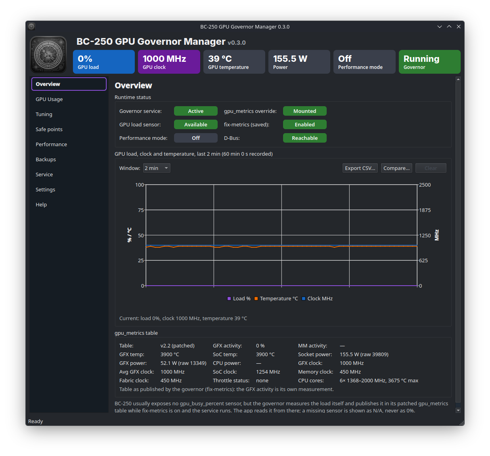
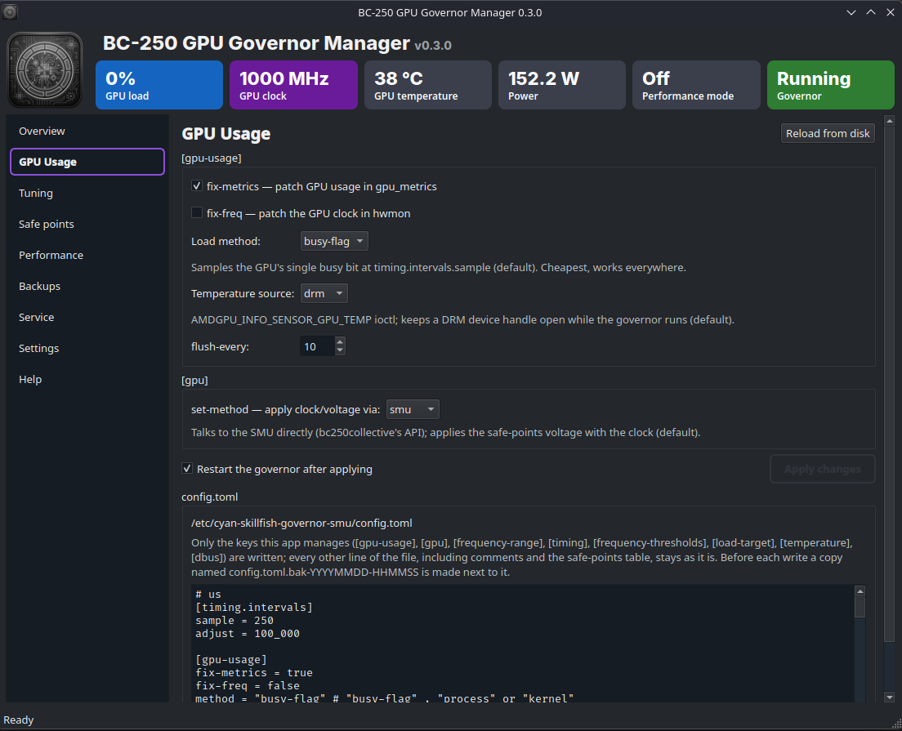
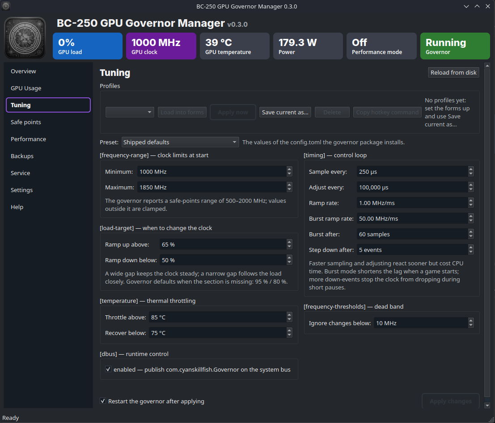
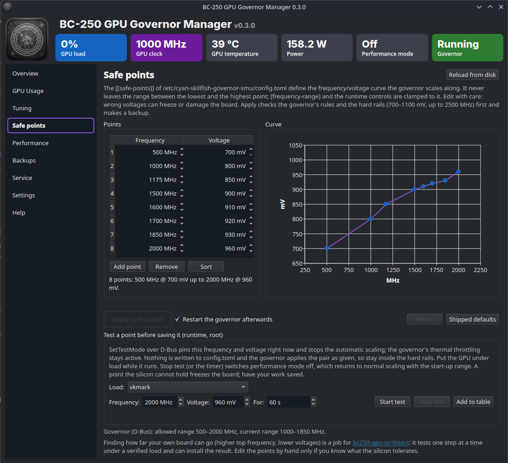
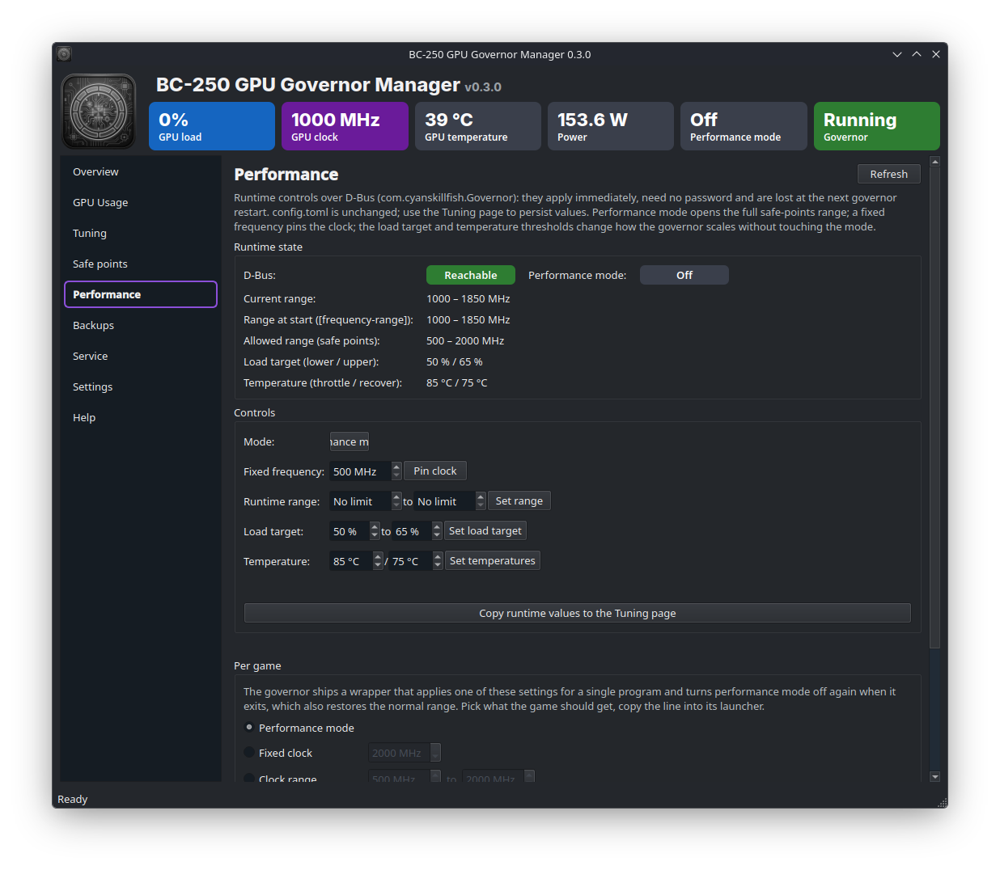
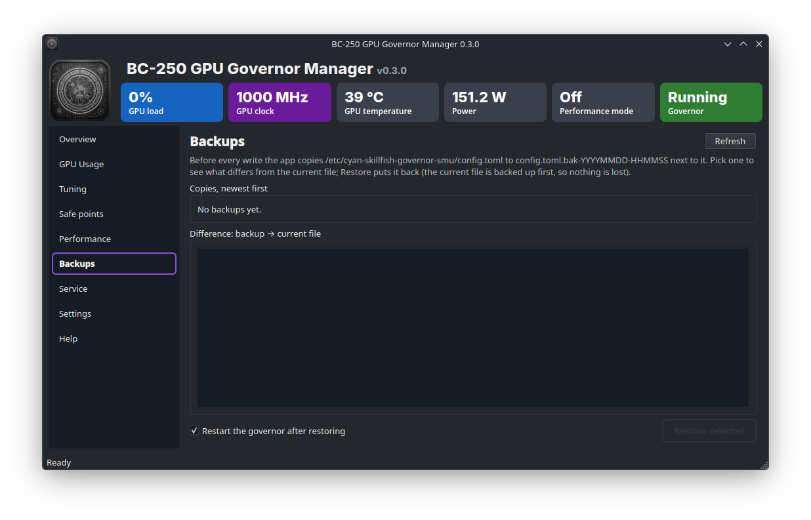
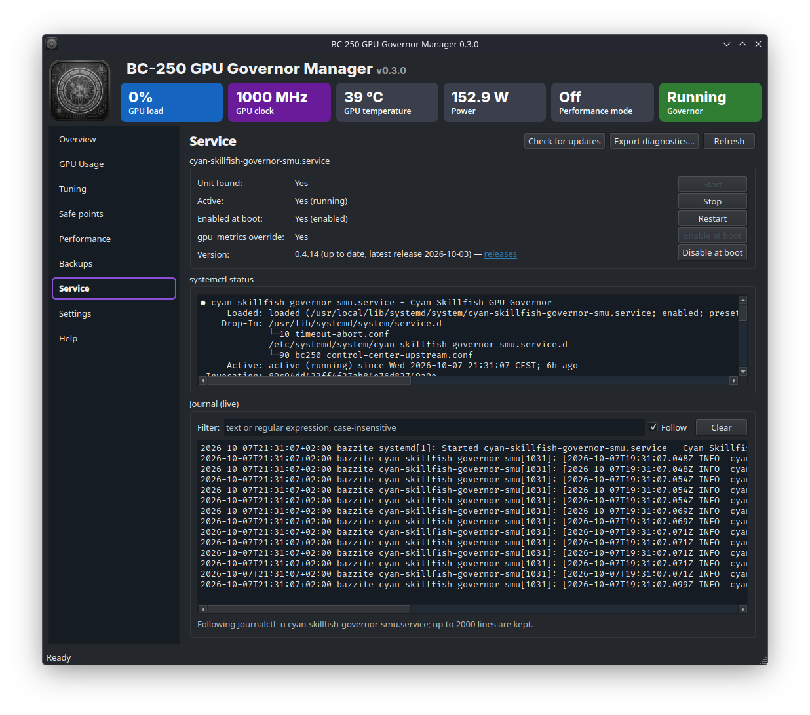
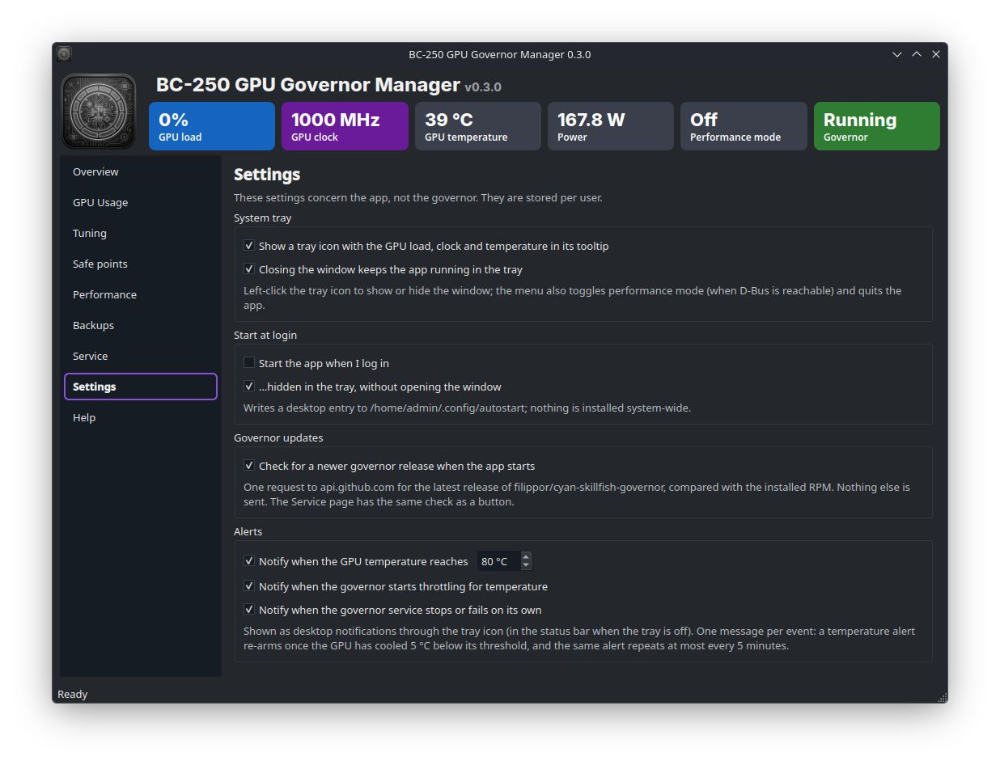
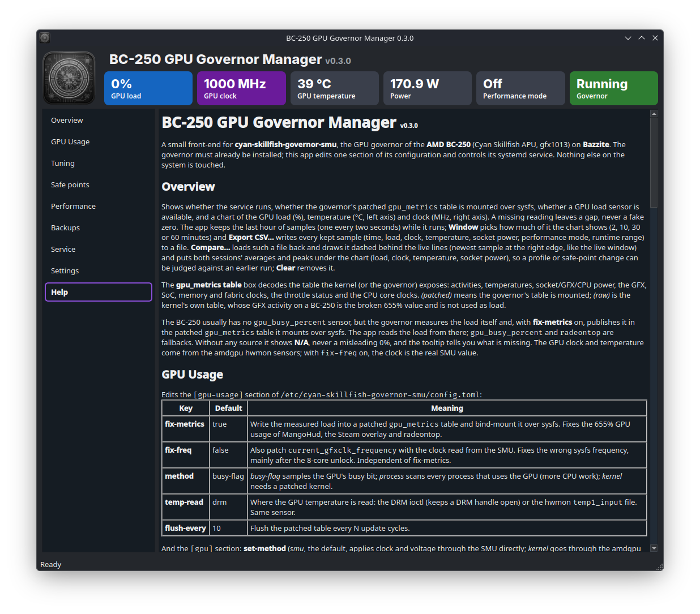

[](https://www.gnu.org/licenses/gpl-3.0) [](https://github.com/RobertoTorino/bc250-governor-manager/actions/workflows/release.yml) 

---

# BC-250 GPU Governor Manager


PyQt6 front-end for **cyan-skillfish-governor-smu**, the GPU governor of an **AMD BC-250** board (Cyan
Skillfish APU, `gfx1013`) running **Bazzite** (Fedora Atomic / rpm-ostree).

The governor itself must already be installed (COPR `filippor/bazzite`, see
[filippor/cyan-skillfish-governor, `smu` branch](https://github.com/filippor/cyan-skillfish-governor/tree/smu)).

```bash
sudo rpm-ostree install cyan-skillfish-governor-smu
systemctl reboot

# view configuration
sudo nano /etc/cyan-skillfish-governor-smu/config.toml
```
This app edits one section of its configuration and controls its systemd service; nothing else on the
system is touched.

---

## What it manages

* The `[gpu-usage]` section of `/etc/cyan-skillfish-governor-smu/config.toml`:

  | Key           | Default     | Meaning                                                                                                                             |
  |---------------|-------------|-------------------------------------------------------------------------------------------------------------------------------------|
  | `fix-metrics` | `true`      | Patch the GPU usage in `gpu_metrics` and bind-mount it over sysfs (fixes the 655% bug of MangoHud, the Steam overlay and radeontop) |
  | `fix-freq`    | `false`     | Also patch `current_gfxclk_frequency` with the real SMU clock (wrong sysfs frequency, mainly after the 8-core unlock)               |
  | `method`      | `busy-flag` | How the load is sampled: `busy-flag`, `process` or `kernel` (needs a patched kernel)                                                |
  | `temp-read`   | `drm`       | Where the GPU temperature is read: DRM ioctl or hwmon `sysfs`                                                                       |
  | `flush-every` | `10`        | Flush the patched table every N update cycles                                                                                       |

* The `[gpu]` section: `set-method` (`smu`, default: clock and voltage through the SMU directly; `kernel`: through
  the amdgpu sysfs interface).
* The `[frequency-range]` (`min`/`max` MHz, 0 = no limit), `[load-target]` (`upper`/`lower` ramp thresholds),
  `[temperature]` (`throttling`, optional `throttling_recovery`) and `[dbus]` (`enabled`) sections, with presets
  *Shipped defaults*, *Quiet*, *Responsive* and *Maximum clock*.
* The control loop: `[timing.intervals]` (`sample`/`adjust` in µs), `[timing.ramp-rates]` (`normal`/`burst` in
  MHz/ms), `[timing]` (`burst-samples`, 0/*Off* = key left out; `down-events`) and `[frequency-thresholds]`
  (`adjust`, the dead band in MHz). Validated like the governor does: `adjust ≥ sample`, `burst > normal`,
  `burst-samples` 1–64.

  Only known keys are written. Every other line of the file, including comments, stays as it is; missing keys
  are appended to their section and missing sections are created. Before each write a copy
  `config.toml.bak-YYYYMMDD-HHMMSS` is made next to it.
* The governor's D-Bus interface (`com.cyanskillfish.Governor`, system bus, via `busctl`): performance mode
  on/off, a fixed frequency, a runtime min/max range, a runtime load target and temperature thresholds, plus the
  current, initial and allowed ranges. Needs `[dbus] enabled = true` in the config (the shipped file has it). The root-only
  `TestMode` interface (`SetTestMode`, via `pkexec`) pins a frequency *and* voltage so a safe point can be tried
  under load before it goes into the file.
* `cyan-skillfish-governor-smu.service`: start, stop, restart, enable, disable, `systemctl status` and a live
  journal tail with filter.
* Overview: service state, whether the patched `gpu_metrics` table is mounted, GPU load, clock, temperature,
  socket power, a GPU load chart and the decoded `gpu_metrics` v2.x table (activities, temperatures, power,
  clocks, throttle status, CPU core clocks).

The BC-250 usually exposes no `gpu_busy_percent` sensor, but the governor measures the load itself and, with
`fix-metrics` on, publishes it as `average_gfx_activity` in the patched `gpu_metrics` table it bind-mounts over
sysfs. The app reads the load from there (falling back to `gpu_busy_percent`, then `radeontop` if installed: `rpm-ostree install radeontop`).
When no source is usable it shows **N/A**, never a misleading 0%, and the tooltip says what to do about it
(install the governor, enable `fix-metrics`, start the service).

## Privilege model

The app runs as your normal desktop user. Only four things need root and go through `pkexec`, one prompt
each: the backup plus write of `config.toml` (a single call), the `systemctl` actions, and the safe-point test
(`busctl` on the governor's root-only TestMode interface). The password is
handled by the desktop's polkit agent; the app never sees it.

## Requirements

```text
Python 3.11+
PyQt6>=6.11,<7
PyQt6-Charts>=6.11,<7
```

The PyQt6 wheels bundle Qt; nothing is layered with `rpm-ostree`.

## Install on Bazzite

Download the latest `bc250-governor-manager-vX.Y.Z.tar.gz` from the
[releases](https://github.com/RobertoTorino/bc250-governor-manager/releases), unpack it and run the installer:

```shell
tar -xzf bc250-governor-manager-v*.tar.gz
cd bc250-governor-manager-v*/
./install.sh
```

It installs the app for your user only, no root and no `rpm-ostree` layering: a private venv with PyQt6 and
the app under `~/.local/share/bc250-governor-manager`, the launcher `~/.local/bin/bc250-governor-manager`,
a desktop entry, the icon and a Desktop icon (`./install.sh --no-desktop-shortcut` leaves the Desktop icon
out). **BC-250 GPU Governor Manager** then appears in the application menu (and in
Steam's Game Mode via *Add a Non-Steam Game* if you want it there). Run `./install.sh` again from a newer
release to update, `./install.sh --uninstall` to remove it; the governor's `config.toml` is never touched.

## Run from the repository

```shell
git clone https://github.com/RobertoTorino/bc250-governor-manager.git
cd bc250-governor-manager
python3 -m venv python && python/bin/pip install -r requirements.txt && python/bin/python -m bc250_governor
```

`python -m bc250_governor --config PATH` points the app at another `config.toml`, for development on a
machine without the governor. `--start-in-tray` starts hidden in the system tray (used by the login autostart
entry). `--profile NAME` applies a saved profile — in the already running instance when there is one (the app
runs once per user, over a local socket; a plain second launch raises the window), otherwise it starts and applies
— which makes it the command to bind to a desktop keyboard shortcut; *Copy hotkey command* on the Tuning page
puts the exact line on the clipboard. `--list-profiles` prints the saved names. `--version` prints the version.

### The older `tt` governor

`--backend tt` manages **cyan-skillfish-governor-tt** instead (the `tt` branch of the same project: unit
`cyan-skillfish-governor-tt.service`, config `/etc/cyan-skillfish-governor-tt/config.toml`). The default
`--backend auto` picks whichever unit systemd has loaded, smu when neither is. The tt governor has no
`[gpu-usage]` fix, no `[gpu]` set-method, no `[frequency-range]`, no `timing.down-events`, no D-Bus and no GitHub
releases, so the GPU Usage and Performance pages, those Tuning sections and fields, the gpu_metrics/performance
status and the update check are hidden; the GPU load sensor stays unavailable with it. Load target, temperature,
timing, frequency thresholds, safe points, backups and the service page work the same.

## Pages

<details>
<summary>🔽 1 - Overview page </summary>



</details>

* **Overview** — runtime status pills, a chart of GPU load, temperature and clock with a 2/10/30/60-minute
  window over the last hour of samples, *Export CSV…* for the whole history, *Compare…* to overlay an earlier
  export dashed with both sessions' averages/peaks, and the `gpu_metrics` table.

<details>
<summary>🔽 2 - CPU usage </summary>



</details>

* **2 - GPU Usage** — the `[gpu-usage]` and `[gpu]` editor. *Apply changes* is enabled as soon as a value differs from the
  file; the window title gets a `*`. The governor reads the file at start only, so it is restarted after
  applying unless you untick that option. *Reload from disk* discards the edits. The raw file is shown below.

<details>
<summary>🔽 3 - Tuning </summary>



</details>

* **3 - Tuning** — frequency range, load target, temperature and D-Bus sections with presets and validation on the
  left; the `[timing]` control loop (sample/adjust intervals, ramp rates, burst mode, down-events) and the
  `[frequency-thresholds]` dead band on the right. Apply on either config page writes the pending edits of both.
  Named *profiles* (snapshots of the Tuning and GPU Usage values, per user in
  `~/.config/bc250-governor-manager/profiles.json`) can be saved, loaded into the forms, applied directly or
  deleted; safe points are not part of a profile. *Copy hotkey command* gives the `--profile` command line to
  bind to a desktop shortcut.

<details>
<summary>🔽 4 - Safe points </summary>



</details>

* **4 - Safe points** — the `[[safe-points]]` frequency/voltage curve as editable table and chart: add/remove points,
  shipped defaults, revert; Apply only after the governor's rules (unique frequencies, non-decreasing voltage) and
  the hard rails (700–1100 mV, ≤ 2500 MHz) pass, with warnings above 2000 MHz / 1000 mV. Backup + password.
  *Test a point before saving it*: pins frequency and voltage over the root-only TestMode D-Bus interface (pkexec,
  thermal throttling stays on, nothing written), prefilled from the selected row, with a timer (default 60 s),
  an optional load generator from PATH (vkmark / glmark2 / vkcube / glxgears) that runs for the test's duration
  and is reported if it dies, a kernel-log watch (`journalctl -k -f`) that aborts the test on the first amdgpu
  ring timeout / GPU reset / `*ERROR*` / SMU failure and quotes it, a result line (held time, peak temperature,
  clock range, kernel verdict) and *Add to table* to turn a held point into a safe point; closing the app or any
  Performance-page action ends the test too.

<details>
<summary>🔽 5 - Performance </summary>



</details>

* **5 - erformance** — runtime D-Bus controls (performance mode, pinned clock, runtime range, load target,
  temperature thresholds), the live ranges and targets, a button to copy them to the Tuning page, and a *Per game* generator for the governor's
  `cyan-skillfish-performance-mode` wrapper (performance mode, fixed clock, range, load target, temperature; for
  Steam `%command%`, Heroic/Lutris or a terminal) with a Copy button. No password needed; runtime changes are lost
  at the next governor restart.

<details>
<summary>🔽 6 - Backups </summary>



</details>

* **6 - Backups** — the `config.toml.bak-*` copies with a diff against the current file and one-click restore.

<details>
<summary>🔽 7 - Service </summary>



</details>

* **7 - Service** — unit state, the five service buttons, `systemctl status`, a live, filterable journal tail, and
  *Export diagnostics…*: one text file (versions, config, status, journal, raw `gpu_metrics`) for bug reports, and
  *Check for updates*: installed RPM versus the latest GitHub release of the governor (also at start, see Settings).

<details>
<summary>🔽 8 - Settings </summary>



</details>

* **8 - Settings** — app settings: system tray icon (load / clock / temperature in the tooltip, performance mode
  toggle, *Apply profile* submenu, show/hide, quit), close-to-tray, a per-user login autostart entry in
  `~/.config/autostart`, the governor update check at start, and alerts (desktop notifications when the GPU
  reaches a chosen temperature, when it reaches the governor's throttling temperature, and when the governor
  service stops or fails on its own; edge-triggered with hysteresis and a cooldown).

<details>
<summary>🔽 9 - Help </summary>



</details>

* **9 - Help** — the same information inside the app, with links.

The window size and the last page are remembered.

## Development

```
bc250_governor/
  __init__.py       app name, version, paths
  __main__.py       entry point (python -m bc250_governor)
  main_window.py    header, navigation, polling, pkexec and D-Bus actions
  pages.py          Overview and Service pages
  history.py        telemetry history ring buffer, CSV export/import and session summaries
  stress.py         load-generator detection and runner for safe-point tests
  kernelwatch.py    journalctl -k tail that aborts a safe-point test on amdgpu/SMU errors
  config_pages.py   GPU Usage and Tuning editors, presets
  performance_page.py  runtime D-Bus controls
  profiles.py       named profiles: JSON store and the Profiles box on the Tuning page
  instance.py       one instance per user: local socket that takes `show` / `profile NAME` requests
  safepoints_page.py   [[safe-points]] table and curve
  backups_page.py   backup list, diff, restore
  journal.py        live journalctl tail with filter
  diagnostics.py    diagnostics report for bug reports
  update_check.py   governor update check (rpm -q vs GitHub latest release, in a QThread)
  launch_options.py per-game launch option generator (Performance page)
  tray.py           system tray icon and autostart entry helpers
  settings_page.py  Settings page
  alerts.py         temperature / throttling / service alerts derived from the polled snapshot
  help.py           Help page
  widgets.py        status pills, metric boxes, terminal, rounded tooltip
  backends/
    base.py         GovernorConfig, ServiceStatus, GpuTelemetry, PerformanceState, backend protocol
    cyan_skillfish.py  schema-driven config.toml editing, systemd, sensors (smu governor)
    cyan_skillfish_tt.py  subclass for the older tt governor: fewer sections, no D-Bus
    gpu_metrics.py  gpu_metrics v2.1/v2.2 struct parser
    dbus.py         busctl client for com.cyanskillfish.Governor
    process.py      subprocess helper
  fonts/            Inter (SIL OFL), used for the header on Linux
install.sh          per-user installer (venv, launcher, desktop entry, icon); --uninstall removes it
bc250-governor-manager.desktop  desktop entry template, Exec is filled in by install.sh
tests/              pytest suite (offscreen Qt; bus, systemd and pkexec mocked)
test.sh             runs it with the project venv
```

Tests: `./test.sh` (uses the `python/` venv, installs pytest there on first use; extra arguments go to pytest,
e.g. `./test.sh -k profile`). Without the venv: `pip install -r requirements-dev.txt` then
`QT_QPA_PLATFORM=offscreen python -m pytest -q tests`. They
cover the config.toml schema round-trip (both governors), safe-point parsing/rendering, the alert monitor, the
telemetry history and CSV export, profiles, the load-tool runner and the main window's TestMode, profile and
Performance-page state machines, all without a BC-250: D-Bus, systemd and pkexec are mocked.
`.github/workflows/tests.yml` runs the same on every push and pull request. What the mocks cannot prove is
covered by the manual pass in `docs/HARDWARE-CHECKLIST.md`, meant to be run on a BC-250 after each release.

Every push to `main` builds a release tarball (`.github/workflows/release.yml`) with the version stamped in,
tags it and publishes it on GitHub; the tarball contains the installer.

The backend is separate from the Qt UI so other governors (for example `cyan-skillfish-governor-tt`) can be
added behind the same protocol.

## License

GPL-3.0-or-later, see [LICENSE](LICENSE). The bundled Inter font is under the SIL Open Font License
(`bc250_governor/fonts/Inter-LICENSE.txt`).

---

      

**[RobertoTorino](https://github.com/RobertoTorino)**   
